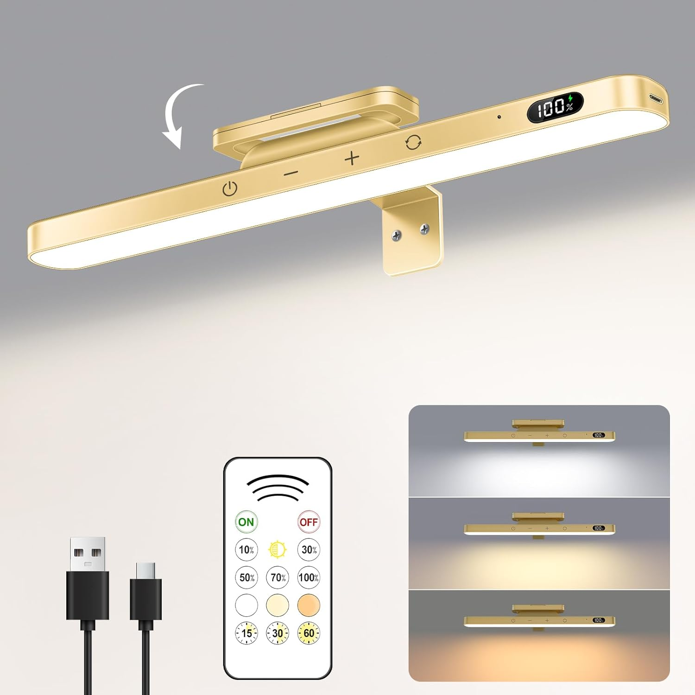

<h1 align="center">
  ESPHome-IR-Light
</h1>

<h4 align="center">An ESPHome Config for controlling an IR remote controllable light.</h4>

## Features

* [x] Based on [ESPHome][esphome]
* [x] Realtime transmission to Home Assistant
* [x] Emulation of State via ESPHome device (on/off, brightness, color temp)

## What you need

* An ESP8266, ESP32 or similar board
  * A power supply (preferrably USB)
* An IR transmitter board

## Flashing the firmware

* Create a new ESPHome configuration YAML file
* Copy the contents of [esphome-ir-light.yaml](esphome-ir-light.yaml) into it
* Customize the basic device cnfiguration (Board, WiFi, etc.) to your liking
* Flash it onto your ESP based board

## Connect to Home Assistant

Add the ESPHome device to Home Assistant via the "Integrations" page.
The sensors and buttons will automatically appear.

# License

CC0 see [LICENSE](LICENSE)

[esphome]: https://esphome.io/